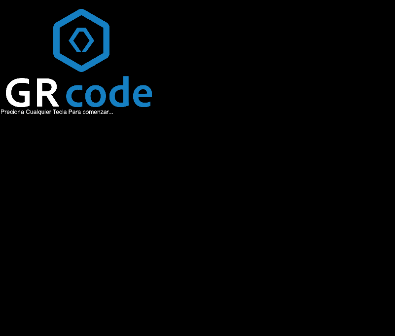

<div align="center">

# GRmenu

**Suite TUI y Menus Interactivos para Terminal en Modo TTY Crudo**

Soporte completo para **Ruby (v3.0)** y **Python (v0.2)**, con Banners ASCII 3D, seleccion multiple con checkboxes, sliders en tiempo real, visor de imagenes ANSI TrueColor, modo cromatico RGB animado a 30 FPS, modales nativos, buscador en vivo, cuadriculas 2D, barras de progreso y spinners sin dependencias externas.

| Ruby (Gema) | Python (PyPI) |
|:---:|:---:|
| [](https://rubygems.org/gems/grmenu) [](https://rubygems.org/gems/grmenu) | [](https://pypi.org/project/grmenu/) [](https://pepy.tech/projects/grmenu) |
| [](https://www.ruby-lang.org) | [](https://pypi.org/project/grmenu/) |

[](LICENSE)
[](https://github.com/JoseEduardoGR/GRmenu)


</div>

---

## Tabla de Contenidos

1. [Caracteristicas Principales](#caracteristicas-principales)
2. [Instalacion](#instalacion)
3. [Guia de Inicio Rapido (Ruby y Python)](#guia-de-inicio-rapido)
4. [Nuevas Funcionalidades en Ruby (v3.0)](#nuevas-funcionalidades-en-ruby-v30)
   - [1. Seleccion Multiple con Checkboxes (GRmenu.checkbox)](#1-seleccion-multiple-con-checkboxes-grmenucheckbox)
   - [2. Control Deslizante en Tiempo Real (GRmenu.slider)](#2-control-deslizante-en-tiempo-real-grmenuslider)
   - [3. Renderizado Universal de Imagenes (GRmenu.image)](#3-renderizado-universal-de-imagenes-en-terminal-grmenuimage)
   - [4. Modales Nativos de Confirmacion y Entrada (confirm e input)](#4-modales-nativos-de-confirmacion-y-texto-confirm--input)
   - [5. Modo RGB Chroma Wave Animado a 30 FPS](#5-modo-rgb-chroma-wave-animado)
   - [6. Barra de Progreso y Spinner con Modo RGB](#6-barra-de-progreso-y-spinner-con-modo-rgb)
   - [7. Modulo de Color (Color / C)](#7-paleta-de-colores-y-modulo-color)
5. [Ejemplo Completo en Ruby (e.rb)](#ejemplo-completo-en-ruby-erb)
6. [Ejemplo Completo en Python](#ejemplo-completo-en-python)
7. [10 Fuentes ASCII 3D para Banners (font: 1..10)](#10-fuentes-ascii-3d-para-banners-font-110)
8. [20 Estilos de Marco y Bordes (style: 1..20)](#20-estilos-de-marco-y-bordes-style-120)
9. [Referencia Exhaustiva de la API](#referencia-de-la-api)
10. [Licencia](#licencia)

---

## Caracteristicas Principales

- **Navegacion intuitiva por teclado:** Arriba/abajo con salto continuo (*Snake wrap*), `Enter` para ejecutar, `q` para salir.
- **Modo RGB Chroma Wave Animado (30 FPS, 0 Lag):** Flujo sinusoidal de colores en tiempo real para marcos, titulos, banners, opciones, barras de progreso y cursores sin retraso de CPU.
- **Seleccion Multiple con Checkboxes (`GRmenu.checkbox`):** Lista interactiva con casillas `[X]` / `[ ]` (`Espacio`, marcar todos con `a`, ninguno con `n`, invertir con `i`).
- **Control Deslizante Interactivo (`GRmenu.slider` / `range`):** Barra de nivel ajustable en tiempo real con flechas (`← / →`) para valores numericos, rangos y unidades.
- **Visor de Imagenes ANSI TrueColor de 24 bits (`GRmenu.image`):** Decodifica y renderiza fotos PNG, JPEG, JPG, WEBP, GIF y BMP directamente en la consola.
- **Buscador en Vivo Instantaneo (`search: true`):** Filtrado interactivo en tiempo real mientras el usuario escribe caracteres.
- **Cuadricula 2D / Multi-Columna (`columns: 2+`):** Navegacion con las 4 flechas de direccion (`↑`, `↓`, `←`, `→`).
- **Modales y Dialogos Nativos (`confirm` e `input`):** Cuadros emergentes para preguntas Si / No con botones activos y entradas de texto con cursor o modo contrasena (`****`).
- **10 Fuentes ASCII 3D para Banners:** Fuentes tridimensionales (ANSI Shadow, Slant, Doom, Graffiti, Modular, Wire, Block, Stars, etc.).
- **Auto-Paginacion y Scroll Fluido:** Ventana deslizante con indicadores automaticos (`▲ (+N arriba)` / `▼ (+M abajo)`).
- **Descripciones y Tooltips Dinamicos:** Informacion explicativa al pie del marco para la opcion enfocada.
- **Spinners y Barras de Progreso:** Helpers nativos `GRmenu.spinner` y `GRmenu.progress` integrados.
- **20 Estilos de Borde:** Desde lineas dobles y curvas redondeadas hasta bloques solidos y estrellas.
- **100% Multiplataforma:** Compatible con Linux, macOS y Windows Terminal.
- **Cero dependencias externas:** Utiliza unicamente la libreria estandar (`io/console`, `json`, `zlib` en Ruby; `termios`/`tty` en Python).

---

## Instalacion

### Ruby (RubyGems)

```bash
gem install grmenu
```

O en tu `Gemfile`:

```ruby
gem 'grmenu', '~> 3.0'
```

### Python (PyPI)

```bash
pip install grmenu
```

---

## Guia de Inicio Rapido

### Ruby

```ruby
require 'GRmenu'

def iniciar_servidor
  puts Color.bright_green("-> Servidor iniciado en puerto 3000...")
  GRmenu.continue
end

def ver_estado
  puts Color.bright_cyan("-> Estado: Operativo y estable")
  GRmenu.continue
end

menu = GRmenu.new(
  [
    ["Iniciar Servidor Web", method(:iniciar_servidor), "Lanza el proceso Puma en background"],
    ["Ver Estado del Sistema", method(:ver_estado), "Muestra metricas de CPU y memoria"]
  ],
  banner: "DEV OPS",
  title: "Panel Principal",
  search: true,
  style: 3
)

menu.set_style.banner("rgb")
menu.set_style.title("rgb")
menu.set_style.border("rgb")
menu.set_style.focus("rgb")
menu.draw
```

### Python

```python
from GRmenu import GRmenu

def opcion_uno():
    print("Elegiste uno")

def opcion_dos():
    print("Elegiste dos")

menu = GRmenu(
    [opcion_uno, opcion_dos],
    title="Mi Menu",
    style=19
)

menu.SetStyle.Border("yellow")
menu.SetStyle.Options("white")
menu.SetStyle.Focus("green", 2)
menu.draw()
```

---

## Nuevas Funcionalidades en Ruby (v3.0)

### 1. Seleccion Multiple con Checkboxes (`GRmenu.checkbox`)

```ruby
paquetes = [
  ["Servidor Nginx Web", true, "Proxy inverso de alta velocidad"],
  ["Base de Datos PostgreSQL", true, "Motor relacional principal"],
  ["Memoria Cache Redis", false, "Almacen en memoria"],
  ["Monitor Prometheus", false, "Metricas del cluster"]
]

seleccionados = GRmenu.checkbox(
  paquetes,
  title: "Instalador de Paquetes",
  subtitle: "Espacio: Marcar | a: Todos | n: Ninguno | i: Invertir | Enter: Confirmar",
  color: "rgb",
  style: 3
)

puts "Componentes seleccionados: #{seleccionados.length}"
```

---

### 2. Control Deslizante en Tiempo Real (`GRmenu.slider`)

```ruby
ram = GRmenu.slider(
  "Asignar Memoria RAM para Servidor",
  min: 1,
  max: 64,
  step: 1,
  default: 16,
  unit: "GB",
  color: "rgb",
  style: 3
)

puts "Memoria configurada: #{ram} GB"
```

---

### 3. Renderizado Universal de Imagenes en Terminal (`GRmenu.image`)

```ruby
# 1. Renderizado directo en consola
GRmenu.image("assets/logo.png", width: 60, color: "rgb", style: 3)

# 2. Como cabecera en un menu interactivo
sub = GRmenu.new(
  [:opcion1, :opcion2],
  image: "assets/fondo.jpeg",
  image_width: 44,
  title: "Galeria de Wallpapers"
)
sub.draw
```

---

### 4. Modales Nativos de Confirmacion y Texto (`confirm` / `input`)

```ruby
# Cuadro interactivo para entrada de texto
usuario = GRmenu.input("Ingresa tu nombre de usuario:", default: "admin", color: "rgb")

# Cuadro para claves secretas (modo password con asteriscos)
clave = GRmenu.input("Ingresa tu token de acceso:", password: true, color: "magenta")

# Dialogo emergente Si / No
if GRmenu.confirm("Deseas activar privilegios para #{usuario}?", default: true, color: "rgb")
  puts Color.bright_green("-> Privilegios otorgados.")
end
```

---

### 5. Modo RGB Chroma Wave Animado

```ruby
menu = GRmenu.new(opciones, banner: "CHROMA", title: "Panel RGB")

menu.set_style.banner("rgb")
menu.set_style.title("rgb")
menu.set_style.border("rgb")
menu.set_style.divider("rgb")
menu.set_style.focus("rgb")
menu.set_style.options("rgb")

menu.draw
```

---

### 6. Barra de Progreso y Spinner con Modo RGB

```ruby
# Barra de progreso con estado dinamico
GRmenu.progress(100, title: "Descargando Actualizacion", color: "rgb") do |bar|
  10.times do |i|
    sleep 0.1
    bar.advance(10, status: "Bloque #{i + 1}/10 procesado...")
  end
end

# Spinner animado para tareas en segundo plano
GRmenu.spinner("Verificando integridad del sistema...", color: "rgb") do
  sleep 1.2
end
```

---

### 7. Paleta de Colores y Modulo `Color`

```ruby
# 1. Modo Arcoiris Chroma Dinamico
puts Color.rgb("Texto degradado en onda multicolor continua")

# 2. Metodos directos por color
puts Color.bright_green("Texto verde brillante")
puts Color.bright_cyan("Cian brillante")
puts Color.bright_magenta("Magenta brillante")
puts Color.bright_yellow("Texto amarillo brillante")
puts Color.orange("Texto naranja")
puts Color.purple("Texto morado")
puts Color.pink("Texto rosa")
puts Color.gray("Texto gris")
```

---

## Ejemplo Completo en Ruby (`e.rb`)

A continuacion se muestra el archivo [`ruby/e.rb`](ruby/e.rb) que incluye todos los componentes interactivos de la libreria:

```ruby
# frozen_string_literal: true

require "GRmenu"

# 1. Definicion de acciones del sistema
def iniciar_servidor
  GRmenu.clear_screen
  puts Color.bright_green("-> Servidor iniciado correctamente en http://localhost:3000")
  puts Color.gray("   Worker PID: #{Process.pid} | Entorno: Produccion | Hilos: 16")
  GRmenu.continue
end

def crear_respaldo
  GRmenu.clear_screen
  puts Color.bright_cyan("-> Creando respaldo completo de la base de datos...")
  puts Color.bright_white("   Destino: /var/backups/db_backup_#{Time.now.strftime('%Y%m%d_%H%M%S')}.sql.gz")
  GRmenu.continue
end

def ver_metricas
  GRmenu.clear_screen
  puts Color.rgb("=== Metricas del Servidor en Tiempo Real ===")
  puts Color.bright_green("   CPU:           14% (8 Nucleos activos)")
  puts Color.bright_cyan("   Memoria RAM:   4.8 GB / 16.0 GB (30% en uso)")
  puts Color.bright_yellow("   Almacenamiento: 42.1 GB / 250.0 GB (17%)")
  puts Color.bright_magenta("   Uptime:        18 dias, 4 horas, 22 minutos")
  GRmenu.continue
end

def prueba_banner_rapido
  GRmenu.clear_screen
  GRmenu.banner("OK", 0, color: "rgb", style: 3, font: 1)
  GRmenu.div(46, "rgb", 1, "═")
  puts Color.bright_green("   Banner ASCII 3D y divisor renderizados en Chroma RGB.")
  GRmenu.div(46, "rgb", 1, "═")
  GRmenu.continue
end

def ver_ayuda_completa
  GRmenu.clear_screen
  GRmenu.help
  GRmenu.continue
end

def salir
  GRmenu.clear_screen
  puts Color.bright_yellow("-> Sesion finalizada con exito. Hasta pronto!")
  exit(0)
end

# 2. Demos de Carga, Paginacion y Modales
def demo_barra_progreso
  GRmenu.clear_screen
  GRmenu.progress(10, title: "Descargando Paquetes de Actualizacion", color: "rgb", style: 3) do |bar|
    10.times do |i|
      sleep 0.1
      bar.advance(1, status: "Paquete #{i + 1} de 10 completado...")
    end
  end
  puts Color.bright_green("\n-> Descarga e instalacion completadas al 100%!")
  GRmenu.continue
end

def demo_spinner
  GRmenu.clear_screen
  GRmenu.spinner("Conectando con el cluster PostgreSQL en la nube...", color: "rgb") do
    sleep 1.4
  end
  puts Color.bright_green("\n-> Conexion establecida con exito (Latencia: 1.2 ms).")
  GRmenu.continue
end

def demo_paginacion
  GRmenu.clear_screen
  opciones_largas = (1..20).map do |n|
    ["Elemento del Sistema ##{n}", -> {
      GRmenu.clear_screen
      puts Color.bright_cyan("-> Has seleccionado el Elemento ##{n}")
      GRmenu.continue
    }, "Configuracion y detalles avanzados del elemento ##{n}"]
  end

  sub = GRmenu.new(
    opciones_largas,
    title: "Submenu Paginado (20 Elementos)",
    subtitle: "Usa ↑ / ↓ para ver el auto-scroll interactivo",
    style: 7,
    page_size: 6
  )
  sub.set_style.focus("rgb")
  sub.set_style.border("rgb")
  sub.draw(size_max: 42)
end

def demo_buscador_en_vivo
  GRmenu.clear_screen
  servicios = [
    ["Servidor HTTP Nginx",        -> { puts Color.bright_green("-> Nginx Reiniciado"); GRmenu.continue }, "Proxy inverso HTTP principal"],
    ["Servidor Base PostgreSQL",   -> { puts Color.bright_green("-> PostgreSQL Activo"); GRmenu.continue }, "Motor de BD relacional principal"],
    ["Servicio Cache Redis",       -> { puts Color.bright_green("-> Redis Operativo"); GRmenu.continue }, "Almacen en memoria ultrarrapido"],
    ["Servicio de Colas Sidekiq",  -> { puts Color.bright_green("-> Workers listos"); GRmenu.continue }, "Procesamiento en segundo plano"],
    ["Microservicio de Pagos",     -> { puts Color.bright_green("-> Gateway Stripe OK"); GRmenu.continue }, "API de cobros y facturacion"],
    ["Monitor de Logs Elastic",    -> { puts Color.bright_green("-> ElasticSearch activo"); GRmenu.continue }, "Busqueda y agregacion de logs"],
    ["Servicio de Emails SMTP",    -> { puts Color.bright_green("-> Mailer conectado"); GRmenu.continue }, "Envio de notificaciones transaccionales"]
  ]

  sub_search = GRmenu.new(
    servicios,
    title: "Buscador Interactivo en Vivo",
    subtitle: "Escribe letras para filtrar al instante (Backspace borra)",
    search: true,
    style: 3
  )
  sub_search.set_style.banner("rgb")
  sub_search.set_style.focus("rgb")
  sub_search.set_style.border("rgb")
  sub_search.draw(size_max: 48)
end

def demo_cuadricula_columnas
  GRmenu.clear_screen
  panel_acciones = (1..12).map do |i|
    ["Nodo ##{i}", -> {
      GRmenu.clear_screen
      puts Color.bright_cyan("-> Accediste al Nodo ##{i}")
      GRmenu.continue
    }, "Panel de control y metricas del cluster #{i}"]
  end

  sub_grid = GRmenu.new(
    panel_acciones,
    title: "Panel Cuadricula 2D (2 Columnas)",
    subtitle: "Usa las 4 flechas (↑, ↓, ←, →) para moverte en 2D",
    columns: 2,
    style: 7,
    page_size: 4
  )
  sub_grid.set_style.focus("rgb")
  sub_grid.set_style.border("rgb")
  sub_grid.draw(size_max: 48)
end

def demo_modales_confirm_input
  GRmenu.clear_screen
  
  # Modal 1: Entrada de texto interactiva
  nombre = GRmenu.input("Ingresa tu nombre de usuario administrador:", default: "admin", color: "rgb", style: 3)
  
  # Modal 2: Confirmacion interactiva Si / No con flechas
  confirmado = GRmenu.confirm("Deseas activar privilegios de superusuario para '#{nombre}'?", default: true, color: "rgb", style: 3)
  
  GRmenu.clear_screen
  if confirmado
    puts Color.bright_green("-> Acceso concedido con exito para el usuario '#{nombre}'!")
  else
    puts Color.bright_red("-> Operacion cancelada por el usuario.")
  end
  GRmenu.continue
end

def demo_seleccion_multiple
  GRmenu.clear_screen
  paquetes = [
    ["Servidor Nginx Web", true, "Proxy inverso de alto rendimiento"],
    ["Motor PostgreSQL 16", true, "Base de datos relacional robusta"],
    ["Cache Redis 7.2", false, "Almacen clave-valor en memoria RAM"],
    ["Monitor Prometheus", false, "Recoleccion de metricas del sistema"],
    ["Visualizador Grafana", true, "Dashboards de analitica en tiempo real"],
    ["Servicio Docker Engine", true, "Contenedores y virtualizacion ligera"],
    ["Firewall UFW", false, "Reglas de seguridad y filtrado de red"]
  ]

  seleccionados = GRmenu.checkbox(
    paquetes,
    title: "Instalador de Paquetes (Multi-Select)",
    subtitle: "Espacio: Marcar | a: Todos | n: Ninguno | i: Invertir | Enter: Confirmar",
    color: "rgb",
    style: 3
  )

  GRmenu.clear_screen
  if seleccionados.empty?
    puts Color.bright_yellow("-> No seleccionaste ningun paquete para instalar.")
  else
    puts Color.bright_green("-> Paquetes seleccionados para instalacion (#{seleccionados.length}):")
    seleccionados.each_with_index do |p, i|
      nombre = p.is_a?(Array) ? p[0] : p
      puts Color.bright_cyan("   #{i + 1}. [X] #{nombre}")
    end
  end
  GRmenu.continue
end

def demo_slider_interactivo
  GRmenu.clear_screen
  ram = GRmenu.slider(
    "Asignar Memoria RAM para Servidor",
    min: 1,
    max: 64,
    step: 1,
    default: 16,
    unit: "GB",
    color: "rgb",
    style: 3
  )

  GRmenu.clear_screen
  puts Color.bright_green("-> Has configurado exitosamente #{ram} GB de memoria RAM asignada.")
  GRmenu.continue
end

def demo_imagen_terminal
  GRmenu.clear_screen
  img_path = "assets/imagen_demo.png" # Reemplaza con la ruta de tu imagen
  unless File.exist?(img_path)
    puts Color.bright_yellow("-> Coloca una imagen en '#{img_path}' para probar esta funcion.")
    GRmenu.continue
    return
  end

  puts Color.rgb("=== 1. Renderizado Directo con GRmenu.image ===")
  GRmenu.image(img_path, width: 60, color: "rgb", style: 3)
  puts Color.bright_green("\n-> Imagen PNG renderizada con micro-pixeles ANSI TrueColor de 24 bits.")
  GRmenu.continue("Presiona una tecla para ver el submenu con cabecera de imagen...")

  sub = GRmenu.new(
    [
      ["Escanear Puertos",         -> { puts Color.bright_green("-> Escaneando..."); GRmenu.continue }, "Escaneo rapido de red"],
      ["Lanzar Consola",           -> { puts Color.bright_green("-> Iniciando consola..."); GRmenu.continue }, "Herramienta interactiva"],
      ["Capturar Paquetes",        -> { puts Color.bright_green("-> Sniffer activo..."); GRmenu.continue }, "Analisis de trafico de red"],
      ["Volver al Menu Principal", -> { puts Color.bright_yellow("-> Volviendo..."); GRmenu.continue }]
    ],
    image: img_path,
    image_width: 44,
    title: "Toolset de Seguridad",
    subtitle: "Suite de Herramientas\nRenderizado de Imagen en Terminal",
    style: 3,
    banner_style: 3
  )
  sub.set_style.focus("rgb")
  sub.set_style.border("rgb")
  sub.draw(size_max: 48)
end

def demo_imagen_fondo_jpeg
  GRmenu.clear_screen
  img_path = "assets/wallpaper.jpeg" # Reemplaza con la ruta de tu imagen
  unless File.exist?(img_path)
    puts Color.bright_yellow("-> Coloca un fondo en '#{img_path}' para probar esta funcion.")
    GRmenu.continue
    return
  end

  puts Color.rgb("=== 1. Renderizado Directo de JPEG con GRmenu.image ===")
  GRmenu.image(img_path, width: 80, color: "rgb", style: 3)
  puts Color.bright_green("\n-> Imagen JPEG decodificada y renderizada en TrueColor de 24 bits.")
  GRmenu.continue("Presiona una tecla para ver el submenu con fondo JPEG...")

  sub = GRmenu.new(
    [
      ["Ver Informacion de Imagen", -> { puts Color.bright_green("-> Resolucion: 1344x768 (JPEG)"); GRmenu.continue }, "Detalles tecnicos del archivo"],
      ["Aplicar Filtro de Color",   -> { puts Color.bright_cyan("-> Filtro aplicado correctamente"); GRmenu.continue }, "Ajustes de visualizacion"],
      ["Exportar a Terminal",      -> { puts Color.bright_green("-> Exportacion ANSI completada"); GRmenu.continue }, "Generar archivo de texto ANSI"],
      ["Volver al Menu Principal",  -> { puts Color.bright_yellow("-> Volviendo..."); GRmenu.continue }]
    ],
    image: img_path,
    image_width: 44,
    title: "Galeria Wallpaper JPEG",
    subtitle: "Visor de Imagenes en Terminal\nRenderizado Ultra-Rapido con Cache",
    style: 3,
    banner_style: 3
  )
  sub.set_style.focus("rgb")
  sub.set_style.border("rgb")
  sub.draw(size_max: 48)
end

# 3. Menu Principal Interactivo
def main
  menu = GRmenu.new(
    [
      method(:iniciar_servidor),                                    
      :crear_respaldo,                                                 
      ["Metricas del Sistema", method(:ver_metricas)],                 
      ["Probar Barra de Progreso", method(:demo_barra_progreso), "Ejemplo interactivo de GRmenu.progress al 100%"],
      ["Probar Spinner de Carga", method(:demo_spinner), "Animacion en tiempo real para funciones pesadas"],
      ["Seleccion Multiple (Checkbox)", method(:demo_seleccion_multiple), "Marcar/Desmarcar items con Espacio, a, n, i"],
      ["Control Deslizante (Slider / Range)", method(:demo_slider_interactivo), "Ajustar valores numericos interactivamente con ← y →"],
      ["Probar Paginacion (20 items)", method(:demo_paginacion), "Desplazamiento suave con auto-scroll"],
      ["Buscador en Vivo (search: true)", method(:demo_buscador_en_vivo), "Filtro instantaneo en vivo mientras escribes"],
      ["Cuadricula 2D (columns: 2)", method(:demo_cuadricula_columnas), "Navegacion con las 4 flechas (↑, ↓, ←, →)"],
      ["Modales Nativos (Confirm & Input)", method(:demo_modales_confirm_input), "Dialogos emergentes interactivos para preguntas y texto"],
      ["Probar Imagen PNG", method(:demo_imagen_terminal), "Muestra fotos PNG con micro-pixeles ANSI TrueColor"],
      ["Probar Imagen JPEG", method(:demo_imagen_fondo_jpeg), "Muestra imagenes JPEG/JPG con cache instantanea"],
      ["Ejecutar Lambda", -> { puts Color.rgb("Ejecutando bloque lambda dinamico!"); GRmenu.continue }],
      ["Probar Banner Helper", method(:prueba_banner_rapido)],        
      ["Ver Ayuda y Referencia", method(:ver_ayuda_completa), "Abre la guia de documentacion interactiva en consola"],        
      method(:salir)                                                  
    ],
    banner: "GRMENU",                                               
    title: "Panel de Control v3.0",                                         
    subtitle: "Consola de Administracion TTY\nUsa las flechas y Enter",                                                            
    style: 3,                                                         
    banner_style: 3,                                                   
    divider: true,                                                    
    center: true,
    page_size: 7                                             
  )

  # Configuracion completa en modo RGB Chroma Wave
  menu.set_style.font(1)             
  menu.set_style.banner("rgb")   
  menu.set_style.title("rgb")  
  menu.set_style.subtitle("rgb")
  menu.set_style.divider("rgb")  
  menu.set_style.border("rgb") 
  menu.set_style.options("rgb") 
  menu.set_style.focus("rgb")   

  menu.draw(size_max: 44)
end

loop { main }
```

### Video Demostrativo en Accion

[](ruby/assets/grmenu.mp4)

> **Nota:** Puedes reproducir o descargar la grabacion de pantalla interactiva en [`ruby/assets/grmenu.mp4`](ruby/assets/grmenu.mp4).

---

## Ejemplo Completo en Python



```python
from GRmenu import GRmenu

def saludar():
    print("¡Hola desde Python!")

def acerca_de():
    print("GRmenu — Menús interactivos para terminal")

def salir_app():
    print("Hasta luego 👋")
    exit(0)

menu = GRmenu(
    [
        saludar,
        acerca_de,
        salir_app
    ],
    title="GRmenu Demo (Python)",
    style=7
)

menu.SetStyle.Border("magenta")
menu.SetStyle.Options("white")
menu.SetStyle.Focus("cyan", 2)
menu.draw(size_max=32)
```

---

## 10 Fuentes ASCII 3D para Banners (`font: 1..10`)

| ID | Nombre de Fuente | Muestra Visual |
|:--:|:-----------------|:---------------|
| `1` | **ANSI Shadow 3D** *(Default)* | `██████╗  ██╗  ██╗` |
| `2` | **Slant 3D** | `    ____        __  __` |
| `3` | **Doom / Standard 3D** | `   ____      _   _` |
| `4` | **Graffiti Shadow 3D** | `  ,---.      ,--. ,--.` |
| `5` | **Small Slant / Mini 3D** | `   ___     _ _` |
| `6` | **Modular Pipe 3D** | `   _____    _____` |
| `7` | **Bubble / Round Gothic** | `    ____     _  _` |
| `8` | **Double-Line Wire 3D** | `  ╔═════╗  ║     ║` |
| `9` | **Solid Fat 3D Block** | `  ██████▄  ██   ██` |
| `10`| **Arcade Stars Matrix** | `  ★★★★   ★   ★` |

---

## 20 Estilos de Marco y Bordes (`style: 1..20`)

| ID | Muestra | ID | Muestra | ID | Muestra | ID | Muestra |
|:--:|:--------|:--:|:--------|:--:|:--------|:--:|:--------|
| `1` | `#####` (Hash) | `6` | `╓───╖` (Mixto) | `11`| `░░░░░` (Sombra suave) | `16`| `~~~~~` (Ondas) |
| `2` | `┌───┐` (Simple) | `7` | `╭───╮` (Curvas) | `12`| `█████` (Bloque) | `17`| `-----` (Guion) |
| `3` | `╔═══╗` (Doble) | `8` | `▛▀▀▀▜` (Outline) | `13`| `*****` (Asterisco) | `18`| `◆◆◆◆◆` (Rombos) |
| `4` | `┏━━━┓` (Gruesa) | `9` | `▓▓▓▓▓` (Sombra oscura) | `14`| `+++++` (Cruces) | `19`| `●○○○●` (Circulos) |
| `5` | `╒═══╕` (Mixto) | `10`| `▒▒▒▒▒` (Sombra media) | `15`| `=====` (Doble simple) | `20`| `★☆☆☆★` (Estrellas) |

---

## Referencia de la API

### Ruby

#### `GRmenu.new(functions, **opciones)`

| Parametro | Tipo | Default | Descripcion |
|:----------|:-----|:--------|:------------|
| `functions` | `Array` | *Requerido* | Opciones (`Method`, `Symbol`, `["Nombre", accion, tooltip]`, `Proc`). |
| `title:` | `String` | `""` | Titulo en la cabecera del marco de opciones. |
| `banner:` | `String` | `""` | Texto gigante a renderizar en arte ASCII 3D arriba del menu. |
| `subtitle:` | `String` | `""` | Subtitulo descriptivo (soporta multiples lineas con `\n`). |
| `search:` | `Boolean` | `false` | Activa buscador instantaneo interactivo mientras se escribe. |
| `columns:` | `Integer` | `1` | Cantidad de columnas para navegacion en cuadricula 2D. |
| `page_size:` | `Integer` | `auto` | Numero maximo de opciones visibles antes de auto-scroll. |
| `style:` | `Integer` | `19` | Estilo de marco para las opciones (1 al 20). |
| `banner_style:` | `Integer` | `3` | Estilo de marco para el banner (1 al 20). |
| `font:` | `Integer` | `1` | Fuente ASCII 3D del banner (1 al 10). |
| `image:` | `String` | `nil` | Ruta a imagen de cabecera (PNG/JPG/WEBP/GIF/BMP). |
| `image_width:` | `Integer` | `40` | Ancho en columnas de terminal para la imagen. |
| `divider:` | `Boolean/Int` | `true` | Lineas divisorias a la par del ancho del banner. |
| `center:` | `Boolean` | `true` | Centrado simetrico automatico del menu y subtitulo. |

#### `menu.set_style`

| Metodo | Argumentos | Descripcion |
|:-------|:-----------|:------------|
| `banner(color, level=2)` | `(String, Integer)` | Color del banner ASCII 3D (soporta `"rgb"`). |
| `title(color, level=2)` | `(String, Integer)` | Color del titulo del marco (soporta `"rgb"`). |
| `subtitle(color, level=1)` | `(String, Integer)` | Color del subtitulo (soporta `"rgb"`). |
| `divider(color, level=1)` | `(String, Integer)` | Color de las lineas divisorias (soporta `"rgb"`). |
| `border(color, level=1)` | `(String, Integer)` | Color del marco de opciones (soporta `"rgb"`). |
| `options(color, level=1)` | `(String, Integer)` | Color de opciones no activas (soporta `"rgb"`). |
| `focus(color, level=2)` | `(String, Integer)` | Color de la opcion resaltada (soporta `"rgb"`). |
| `font(font_id)` | `(Integer 1..10)` | Fuente tipografica del banner. |

#### Metodos Estaticos

| Metodo | Firma | Retorno |
|:-------|:------|:--------|
| `GRmenu.checkbox` | `(items, title:, color:, style:, page_size:, preselected:)` | `Array` de elementos seleccionados. |
| `GRmenu.slider` | `(prompt, min:, max:, step:, default:, unit:, color:, style:)` | `Numeric` con el valor seleccionado. |
| `GRmenu.confirm` | `(pregunta, default: true, color: "cyan", style: 3)` | `Boolean` (`true` para Si, `false` para No). |
| `GRmenu.input` | `(prompt, default: "", password: false, color: "cyan", style: 3)` | `String` ingresado por el usuario. |
| `GRmenu.image` | `(filepath, width: 40, height: nil, style: 3, color: "cyan")` | Renderiza la imagen en consola. |
| `GRmenu.progress` | `(total = 100, title: nil, color: "cyan", style: 3, &bloque)` | Ejecuta bloque con barra de progreso. |
| `GRmenu.spinner` | `(mensaje = "...", color: "cyan", delay: 0.08, &bloque)` | Ejecuta bloque con spinner animado. |
| `GRmenu.banner` | `(texto, delay = 0, color: "magenta", style: 3, font: 1)` | Imprime texto en arte ASCII 3D. |
| `GRmenu.div` | `(long = nil, color = "blue", level = 1, char = "─")` | Imprime linea divisoria horizontal. |
| `GRmenu.clear_screen`| `()` (Alias: `GRmenu.clr`) | Limpia la pantalla y el scrollback. |
| `GRmenu.continue` | `(texto = "Presiona cualquier tecla...")` | Pausa hasta pulsar una tecla. |
| `GRmenu.help` | `()` | Muestra guia de documentacion en consola. |

---

### Python

#### `GRmenu(functions, title="", style=19)`

| Parametro | Tipo | Descripcion |
|:----------|:-----|:------------|
| `functions` | `list[Callable]` | Funciones a mostrar como opciones, en orden. |
| `title` | `str` | Titulo mostrado en la cabecera del menu. |
| `style` | `int` | Numero de estilo de borde (1 al 20). |

#### `menu.SetStyle`

| Metodo | Descripcion |
|:-------|:------------|
| `SetStyle.Border(color, level=1)` | Color del marco del menu. |
| `SetStyle.Options(color, level=1)`| Color de las opciones sin seleccionar. |
| `SetStyle.Focus(color, level=2)` | Color de la opcion resaltada. |

#### `menu.draw(size_max=20)`

Dibuja el menu interactivo y ejecuta la funcion seleccionada al pulsar `Enter`.

---

## Contribuir

Las contribuciones son bienvenidas. Puedes abrir un [issue](https://github.com/JoseEduardoGR/GRmenu/issues) o enviar un pull request en:  
👉 **[https://github.com/JoseEduardoGR/GRmenu](https://github.com/JoseEduardoGR/GRmenu)**

---

## Licencia

Distribuido bajo licencia [MIT](LICENSE).

<div align="center">

Hecho por [grcode](https://github.com/JoseEduardoGR)

</div>
