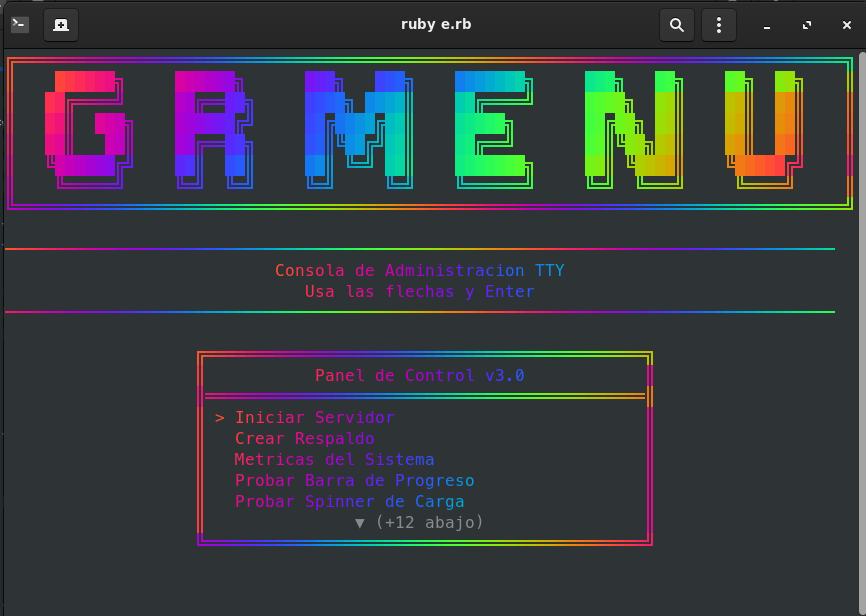

<div align="center">

# GRmenu

**Suite TUI y Menus Interactivos para Terminal en Modo TTY Crudo**

Soporte completo para **Ruby (v4.0.1)** y **Python (v0.2)**, con soporte de raton ANSI SGR 1006 (clic y rueda de scroll), submenus en cascada de hasta 3 niveles (*Sub del Sub*), menu por pestanas multitarea (`GRmenu.tabs`), rediseno de input con marco integrado y cursor en vivo, sistema de temas .gr tipo CSS, exportacion CLI (-theme), tablas interactivas con buscador y ordenamiento, Banners ASCII 3D, seleccion multiple con checkboxes, sliders en tiempo real, visor de imagenes ANSI TrueColor, modo cromatico RGB y Living Neon animado a 30 FPS, colores hexadecimales directos (#RRGGBB), 90+ colores calibrados, modales nativos, buscador en vivo, cuadriculas 2D, barras de progreso y spinners sin dependencias externas.

| Ruby (Gema) | Python (PyPI) |
|:---:|:---:|
| [](https://rubygems.org/gems/grmenu) [](https://rubygems.org/gems/grmenu) | [](https://pypi.org/project/grmenu/) [](https://pepy.tech/projects/grmenu) |
| [](https://www.ruby-lang.org) | [](https://pypi.org/project/grmenu/) |

[](LICENSE)
[](https://github.com/JoseEduardoGR/GRmenu)



</div>

---

## Tabla de Contenidos

1. [Caracteristicas Principales](#caracteristicas-principales)
2. [Instalacion](#instalacion)
3. [Guia de Inicio Rapido (Ruby y Python)](#guia-de-inicio-rapido)
4. [Nuevas Funcionalidades en Ruby (v4.0.1)](#nuevas-funcionalidades-en-ruby-v401)
   - [1. Submenus en Cascada de hasta 3 Niveles (Sub del Sub)](#1-submenus-en-cascada-de-hasta-3-niveles-sub-del-sub)
   - [2. Menu por Pestanas Multitarea (GRmenu.tabs)](#2-menu-por-pestanas-multitarea-grmenutabs)
   - [3. Soporte Completo de Raton ANSI SGR 1006 (mouse: true)](#3-soporte-completo-de-raton-ansi-sgr-1006-mouse-true)
   - [4. Rediseno de Entrada de Datos (GRmenu.input)](#4-rediseno-de-entrada-de-datos-grmenuinput)
   - [5. Sistema de Temas .gr y CSS para TUI (menu, submenu, tabs, input)](#5-sistema-de-temas-gr-y-css-para-tui)
   - [6. Exportacion de Temas desde Terminal / CLI (-theme)](#6-exportacion-de-temas-desde-terminal--cli--theme)
   - [7. CSS Inline en el Codigo (<<-GR)](#7-css-inline-en-el-codigo--gr)
   - [8. Tablas Interactivas con Buscador y Ordenamiento (GRmenu.table)](#8-tablas-interactivas-con-buscador-y-ordenamiento-grmenutable)
   - [9. Tarjetas y Alertas Estilizadas (GRmenu.card y GRmenu.alert)](#9-tarjetas-y-alertas-estilizadas-grmenucard-y-grmenualert)
   - [10. Seleccion Multiple con Checkboxes (GRmenu.checkbox)](#10-seleccion-multiple-con-checkboxes-grmenucheckbox)
   - [11. Control Deslizante en Tiempo Real (GRmenu.slider)](#11-control-deslizante-en-tiempo-real-grmenuslider)
   - [12. Modales Nativos de Confirmacion (GRmenu.confirm)](#12-modales-nativos-de-confirmacion-grmenuconfirm)
   - [13. Renderizado Universal de Imagenes (GRmenu.image)](#13-renderizado-universal-de-imagenes-grmenuimage)
   - [14. Modo RGB Chroma Wave y Living Neon a 30 FPS](#14-modo-rgb-chroma-wave-y-living-neon-a-30-fps)
   - [15. Barra de Progreso y Spinner con Modo RGB](#15-barra-de-progreso-y-spinner-con-modo-rgb)
5. [Laboratorio Interactivo (ruby/eaja.rb y ruby/e.rb)](#laboratorio-interactivo)
6. [Ejemplo Completo en Python](#ejemplo-completo-en-python)
7. [10 Fuentes ASCII 3D para Banners (font: 1..10)](#10-fuentes-ascii-3d-para-banners-font-110)
8. [20 Estilos de Marco y Bordes (style: 1..20)](#20-estilos-de-marco-y-bordes-style-120)
9. [Referencia Exhaustiva de la API](#referencia-de-la-api)
10. [Licencia](#licencia)

---

## Caracteristicas Principales

- **Navegacion por Teclado y Raton:** Arriba/abajo continuo (*Snake wrap*), `Enter` para ejecutar, `Tab` / `Shift+Tab` para pestanas, `→` para abrir submenus, y soporte de raton SGR 1006 (`mouse: true`) con clics y rueda de scroll.
- **Submenus en Cascada de hasta 3 Niveles:** Despliega paneles laterales (`Box 0 ── Box 1 ── Box 2`) con puentes dobles `──` y vista responsiva que se adapta al ancho de tu consola.
- **Menu por Pestanas Multitarea (`GRmenu.tabs`):** Organiza interfaces complejas en paneles horizontales independientes.
- **Rediseno de Entrada de Datos (`GRmenu.input`):** Marco integrado, titulo centrado en el borde superior, etiqueta interior, valor por defecto editable, modo password y cursor de bloque en vivo `█`.
- **Modo RGB Chroma Wave y Living Neon (30 FPS, 0 Lag):** Flujo sinusoidal de colores en tiempo real para marcos, titulos, banners, opciones, barras de progreso y cursores sin retraso de CPU.
- **Seleccion Multiple con Checkboxes (`GRmenu.checkbox`):** Lista interactiva con casillas `[X]` / `[ ]` (`Espacio`, marcar todos con `a`, ninguno con `n`, invertir con `i`).
- **Control Deslizante Interactivo (`GRmenu.slider` / `range`):** Barra de nivel ajustable en tiempo real con flechas (`← / →`) para valores numericos, rangos y unidades.
- **Visor de Imagenes ANSI TrueColor de 24 bits (`GRmenu.image`):** Decodifica y renderiza fotos PNG, JPEG, JPG, WEBP, GIF y BMP directamente en la consola con subpixeles `▀` (proporcion 1:1) y remuestreo Lanczos.
- **Buscador en Vivo Instantaneo (`search: true`):** Filtrado interactivo en tiempo real mientras el usuario escribe caracteres.
- **Cuadricula 2D / Multi-Columna (`columns: 2+`):** Navegacion con las 4 flechas de direccion (`↑`, `↓`, `←`, `→`).
- **Modales y Dialogos Nativos (`confirm` e `input`):** Cuadros emergentes para preguntas Si / No con botones activos y entradas de texto con cursor o modo contrasena (`****`).
- **10 Fuentes ASCII 3D para Banners:** Fuentes tridimensionales (ANSI Shadow, Slant, Doom, Graffiti, Modular, Wire, Block, Stars, etc.).
- **Auto-Paginacion y Scroll Fluido:** Ventana deslizante con indicadores automaticos (`▲ (+N arriba)` / `▼ (+M abajo)`).
- **Descripciones y Tooltips Dinamicos:** Informacion explicativa al pie del marco para la opcion enfocada.
- **Spinners y Barras de Progreso:** Helpers nativos `GRmenu.spinner` y `GRmenu.progress` integrados con firmas flexibles (posicionales y keywords).
- **20 Estilos de Borde:** Desde lineas dobles y curvas redondeadas hasta bloques solidos y estrellas.
- **100% Multiplataforma:** Compatible con Linux, macOS y Windows Terminal.
- **Cero dependencias externas:** Utiliza unicamente la libreria estandar (`io/console`, `json`, `zlib`, `open3` en Ruby; `termios`/`tty` en Python).

---

## Instalacion

### Ruby (RubyGems)

```bash
gem install grmenu
```

O en tu `Gemfile`:

```ruby
gem 'grmenu', '~> 4.0'
```

### Python (PyPI)

```bash
pip install grmenu
```

---

## Guia de Inicio Rapido

### Ruby

```ruby
require 'GRmenu'

def iniciar_servidor
  puts Color.bright_green("-> Servidor iniciado en puerto 3000...")
  GRmenu.continue
end

def ver_estado
  puts Color.bright_cyan("-> Estado: Operativo y estable")
  GRmenu.continue
end

menu = GRmenu.new(
  [
    ["Iniciar Servidor Web", method(:iniciar_servidor), "Lanza el proceso Puma en background"],
    ["Ver Estado del Sistema", method(:ver_estado), "Muestra metricas de CPU y memoria"]
  ],
  banner: "DEV OPS",
  title: "Panel Principal",
  search: true,
  mouse: true,
  style: 3
)

menu.set_style.banner("rgb")
menu.set_style.title("rgb")
menu.set_style.border("rgb")
menu.set_style.focus("rgb")
menu.draw
```

### Python

```python
from GRmenu import GRmenu

def opcion_uno():
    print("Elegiste uno")

def opcion_dos():
    print("Elegiste dos")

menu = GRmenu(
    [opcion_uno, opcion_dos],
    title="Mi Menu",
    style=19
)

menu.SetStyle.Border("yellow")
menu.SetStyle.Options("white")
menu.SetStyle.Focus("green", 2)
menu.draw()
```

---

## Nuevas Funcionalidades en Ruby (v4.0.1)

### 1. Submenus en Cascada de hasta 3 Niveles (*Sub del Sub*)

Organiza opciones de forma jerárquica hasta 3 niveles de profundidad con despliegue lateral unido por puentes dobles `──`:

```text
╔══════════════════════╗  ╔════════════════════╗  ╔════════════════════╗
║ > Servicios       ▶  ║──║     Servicios      ║  ║   Servidores Web   ║
║   Ajustes            ║  ║════════════════════║  ║════════════════════║
╚══════════════════════╝  ║ > Servidores Web ▶ ║──║ > Iniciar NGINX    ║
                          ║   Bases de Datos ▶ ║  ║   Reiniciar Apache ║
                          ╚════════════════════╝  ╚════════════════════╝
```

```ruby
sub_web = [
  ["Iniciar NGINX", -> { GRmenu.card("NGINX", "Servidor activo en puerto 80", pause: false); sleep 1.2 }],
  ["Reiniciar Apache", -> { GRmenu.card("Apache", "Servicio recargado", pause: false); sleep 1.2 }]
]

menu = GRmenu.new(
  [
    ["Servicios", [
      ["Servidores Web", sub_web, "Servidores HTTP -> Sub del Sub"],
      ["Bases de Datos", [["PostgreSQL", -> {}], ["Redis", -> {}]]]
    ], "Administra infraestructura"],
    ["Salir", -> { exit(0) }]
  ],
  title: "Submenus en Cascada",
  style: 3,
  mouse: true
)
menu.draw
```

* `→` abre nivel siguiente, `←` o `Esc` regresa, `Enter` ejecuta acción final.
* Si la terminal es estrecha, desliza automáticamente una ventana fluida `Sub 1 ── Sub 2` para evitar desbordamientos.

---

### 2. Menu por Pestanas Multitarea (`GRmenu.tabs`)

```ruby
tabs_data = {
  "Servidores" => [["API Gateway", -> {}], ["Worker Celery", -> {}]],
  "Bases de Datos" => [["PostgreSQL", -> {}], ["Redis Cache", -> {}]],
  "Configuracion" => [["Cambiar Tema Neon", -> { GRmenu.theme(:cyberpunk) }]]
}

tabs_menu = GRmenu.tabs(tabs_data, title: "Consola Multitarea", style: 3, mouse: true)
tabs_menu.draw
```

* Pulsa `Tab` o `Shift+Tab` para alternar entre pestañas, o haz clic sobre su nombre con el ratón.

---

### 3. Soporte Completo de Raton ANSI SGR 1006 (`mouse: true`)

Al activar `mouse: true` (por defecto `false`):
* **Clic Izquierdo:** Selecciona y enfoca la opción; segundo clic la ejecuta de inmediato.
* **Clic en Pestanas:** Cambia instantáneamente de pestaña activa.
* **Clic en Submenus:** Abre y enfoca la caja lateral del submenú.
* **Rueda de Scroll:** Desplaza el foco vertical hacia arriba o hacia abajo en el panel activo.
* **Paginacion:** Clic en `▲` o `▼` sube o baja de página.

---

### 4. Rediseno de Entrada de Datos (`GRmenu.input`)

```ruby
# Cuadro de entrada estilizado con titulo superior y etiqueta interior
url = GRmenu.input(
  title: "Ingresa tu Configuracion",
  label: "URL del Servidor:",
  default: "http://localhost:8080",
  style: 3,
  border_color: "neon_cyan",
  title_color: "neon_yellow",
  label_color: "white"
)

# Modo password para tokens y claves
token = GRmenu.input(
  title: "Autenticacion Segura",
  label: "Token Secreto:",
  password: true,
  style: 3,
  border_color: "neon_red"
)
```

---

### 5. Sistema de Temas .gr y CSS para TUI

Configuración declarativa de temas con nuevos bloques para `<<submenu`, `<<tabs` y `<<input`:

```gr
GRmenu::config<-1->
@theme:: "CyberNeon"
@author:: "GRcode"
@version:: "4.1"

<<menu
  style:: 3
  banner_style:: 3
  font:: 1
  mouse:: true
  border:: neon_cyan:1
  title:: neon_yellow:2
  focus:: neon_red:2
  options:: white:1
  banner:: neon_magenta:2
>>

<<submenu
  style:: 3
  border:: neon_yellow:1
  focus:: neon_cyan:2
  options:: white:1
  title:: neon_yellow:2
  arrow:: neon_cyan:2
>>

<<tabs
  active_tab:: neon_yellow:2
  tab_color:: gray:1
  indicator:: neon_cyan:2
>>

<<input
  style:: 3
  border_color:: neon_cyan:1
  title_color:: neon_yellow:2
  label_color:: white:2
>>
```

---

### 6. Exportacion de Temas desde Terminal / CLI (-theme)

```bash
# Exporta el tema de cualquier script directamente a un archivo .gr:
ruby mi_app.rb -theme -o mi_tema.gr
```

---

### 7. CSS Inline en el Codigo (`<<-GR`)

```ruby
menu = GRmenu.new(opciones, mouse: true)
menu.style(<<-GR)
<<menu
  style:: 3
  mouse:: true
  border:: neon_cyan:1
  title:: neon_yellow:2
>>
<<submenu
  style:: 3
  border:: neon_yellow:1
  focus:: neon_cyan:2
>>
GR
menu.draw
```

---

### 8. Tablas Interactivas con Buscador y Ordenamiento (`GRmenu.table`)

Acepta argumentos posicionales y por palabra clave:

```ruby
headers = ["ID", "SERVICIO", "ESTADO"]
filas = [
  ["01", "API Gateway", "Operativo"],
  ["02", "PostgreSQL", "Operativo"],
  ["03", "Redis Cache", "En espera"]
]

# Llamada posicional
GRmenu.table(headers, filas, style: 3, header_color: "yellow")

# Llamada por keywords
GRmenu.table(headers: headers, rows: filas, title: "Monitor", search: true, sort: true)
```

---

### 9. Tarjetas y Alertas Estilizadas (`GRmenu.card` y `GRmenu.alert`)

```ruby
# Tarjeta con argumentos posicionales
GRmenu.card("NGINX Web Server", "NGINX iniciado en puerto 80", style: 3, border_color: "green", pause: false)

# Alertas
GRmenu.alert(:success, "Operacion completada con exito.")
GRmenu.alert(:error, "Fallo al conectar con el nodo.", pause: false)
```

---

### 10. Seleccion Multiple con Checkboxes (`GRmenu.checkbox`)

```ruby
paquetes = [
  ["Servidor Nginx Web", true, "Proxy inverso de alta velocidad"],
  ["Base de Datos PostgreSQL", true, "Motor relacional principal"],
  ["Memoria Cache Redis", false, "Almacen en memoria"]
]

seleccionados = GRmenu.checkbox(paquetes, title: "Instalador de Paquetes", color: "neon_cyan", style: 3)
```

---

### 11. Control Deslizante en Tiempo Real (`GRmenu.slider`)

```ruby
ram = GRmenu.slider("Asignar Memoria RAM:", min: 1, max: 64, step: 1, default: 16, unit: "GB", color: "gold", style: 3)
```

---

### 12. Modales Nativos de Confirmacion (`GRmenu.confirm`)

```ruby
if GRmenu.confirm("Deseas reiniciar el servidor?", default: true, color: "neon_green", style: 3)
  puts "Reiniciando..."
end
```

---

### 13. Renderizado Universal de Imagenes (`GRmenu.image`)

```ruby
GRmenu.image("assets/logo.png", width: 40, style: 3, color: "neon_cyan", center: true)
```

---

### 14. Modo RGB Chroma Wave y Living Neon a 30 FPS

```ruby
menu = GRmenu.new(opciones, banner: "CHROMA", title: "Panel RGB", animate: "diagonal")
menu.set_style.banner("rgb").title("rgb").border("rgb").focus("rgb")
menu.draw
```

---

### 15. Barra de Progreso y Spinner con Modo RGB

```ruby
GRmenu.progress(100, title: "Descargando Actualizacion", color: "neon_yellow", style: 3) do |bar|
  10.times { sleep 0.1; bar.advance(10, status: "Procesando...") }
end

GRmenu.spinner("Verificando integridad...", color: "neon_cyan") do
  sleep 1.2
end
```

---

## Laboratorio Interactivo

Ejecuta el laboratorio para probar los submenús en cascada de 3 niveles, pestañas y el ratón:

```bash
ruby ruby/eaja.rb
```

O el laboratorio general de componentes:

```bash
ruby ruby/e.rb
```

---

## Ejemplo Completo en Python

```python
from GRmenu import GRmenu

def ver_tabla():
    print("Mostrando tabla...")

def salir():
    print("Adios!")

menu = GRmenu(
    [ver_tabla, salir],
    title="Panel Python",
    style=3
)
menu.SetStyle.Border("cyan")
menu.SetStyle.Focus("yellow", 2)
menu.draw()
```

---

## 10 Fuentes ASCII 3D para Banners (font: 1..10)

| ID | Nombre de Fuente | Muestra Visual |
|:--:|:-----------------|:---------------|
| `1` | **ANSI Shadow 3D** *(Default)* | `██████╗  ██╗  ██╗` |
| `2` | **Slant 3D** | `    ____        __  __` |
| `3` | **Doom / Standard 3D** | `   ____      _   _` |
| `4` | **Graffiti Shadow 3D** | `  ,---.      ,--. ,--.` |
| `5` | **Small Slant / Mini 3D** | `   ___     _ _` |
| `6` | **Modular Pipe 3D** | `   _____    _____` |
| `7` | **Bubble / Round Gothic** | `    ____     _  _` |
| `8` | **Double-Line Wire 3D** | `  ╔═════╗  ║     ║` |
| `9` | **Solid Fat 3D Block** | `  ██████▄  ██   ██` |
| `10`| **Arcade Stars Matrix** | `  ★★★★   ★   ★` |

---

## 20 Estilos de Marco y Bordes (style: 1..20)

| ID | Muestra | ID | Muestra | ID | Muestra | ID | Muestra |
|:--:|:--------|:--:|:--------|:--:|:--------|:--:|:--------|
| `1` | `#####` (Hash) | `6` | `╓───╖` (Mixto) | `11`| `░░░░░` (Sombra suave) | `16`| `~~~~~` (Ondas) |
| `2` | `┌───┐` (Simple) | `7` | `╭───╮` (Curvas) | `12`| `█████` (Bloque) | `17`| `-----` (Guion) |
| `3` | `╔═══╗` (Doble) | `8` | `▛▀▀▀▜` (Outline) | `13`| `*****` (Asterisco) | `18`| `◆◆◆◆◆` (Rombos) |
| `4` | `┏━━━┓` (Gruesa) | `9` | `▓▓▓▓▓` (Sombra oscura) | `14`| `+++++` (Cruces) | `19`| `●○○○●` (Circulos) |
| `5` | `╒═══╕` (Mixto) | `10`| `▒▒▒▒▒` (Sombra media) | `15`| `=====` (Doble simple) | `20`| `★☆☆☆★` (Estrellas) |

---

## Referencia de la API

### Constructor `GRmenu.new(functions, **opciones)`

| Parametro | Tipo | Default | Descripcion |
|:----------|:-----|:--------|:------------|
| `functions` | `Array` | *Requerido* | Opciones (`Method`, `Symbol`, `["Nombre", accion, tooltip]`, submenus anidados o `Proc`). |
| `title:` | `String` | `""` | Titulo en la cabecera del marco de opciones. |
| `banner:` | `String` | `""` | Texto gigante a renderizar en arte ASCII 3D arriba del menu. |
| `subtitle:` | `String` | `""` | Subtitulo descriptivo (soporta multiples lineas con `\n`). |
| `search:` | `Boolean` | `false` | Activa buscador instantaneo interactivo mientras se escribe. |
| `columns:` | `Integer` | `1` | Cantidad de columnas para navegacion en cuadricula 2D. |
| `page_size:` | `Integer` | `auto` | Numero maximo de opciones visibles antes de auto-scroll. |
| `mouse:` | `Boolean` | `false` | Activa soporte de raton ANSI SGR 1006 (clic, scroll, submenus). |
| `tabs:` | `Hash` | `nil` | Estructura de pestanas multitarea horizontales. |
| `style:` | `Integer` | `19` | Estilo de marco para las opciones (1 al 20). |
| `banner_style:` | `Integer` | `3` | Estilo de marco para el banner (1 al 20). |
| `font:` | `Integer` | `1` | Fuente ASCII 3D del banner (1 al 10). |
| `animate:` | `String/Bool` | `false` | Efecto de iluminacion dinamica ("diagonal", "linear", "fade", "rgb"). |
| `desc_prefix:` | `String` | `"[i]"` | Prefijo visual para el tooltip de ayuda. |
| `image:` | `String` | `nil` | Ruta a imagen de cabecera (PNG/JPG/WEBP/GIF/BMP). |
| `image_width:` | `Integer` | `40` | Ancho en columnas de terminal para la imagen. |
| `divider:` | `Boolean/Int` | `true` | Lineas divisorias a la par del ancho del banner. |
| `center:` | `Boolean` | `true` | Centrado simetrico automatico del menu y subtitulo. |

### Metodos Estaticos y Componentes

| Metodo | Firma | Retorno |
|:-------|:------|:--------|
| `GRmenu.tabs` | `(tabs_hash, **opciones)` | Crea un menu interactivo dividido por pestanas horizontales. |
| `GRmenu.theme` | `(nombre_o_simbolo)` | Carga un tema `.gr` predefinido para todo el sistema. |
| `GRmenu.import_config` | `(ruta_archivo_gr)` | Carga un archivo de tema `.gr` personalizado. |
| `GRmenu.export_from_file`| `(script_origen, archivo_gr)` | Extrae el tema de un script sin correr bucles. |
| `GRmenu.style` | `(texto_css_gr)` | Inyecta estilos CSS inline globalmente. |
| `GRmenu.table` | `(headers, rows, ...)` | Muestra tabla interactiva y devuelve fila elegida. |
| `GRmenu.card` | `(title, content, ...)` | Muestra tarjeta con auto-wrap y pause configurable. |
| `GRmenu.alert` | `(tipo, mensaje, ...)` | Muestra alerta emergente contextual. |
| `GRmenu.checkbox` | `(items, ...)` | Devuelve `Array` de elementos seleccionados (`[X]`). |
| `GRmenu.slider` | `(prompt, ...)` | Devuelve `Numeric` con el valor seleccionado. |
| `GRmenu.confirm` | `(pregunta, ...)` | Devuelve `Boolean` (`true` para Si, `false` para No). |
| `GRmenu.input` | `(title: ..., label: ..., ...)` | Entrada de texto redisenada con marco y cursor `█`. |
| `GRmenu.image` | `(filepath, width:, style:, color:)` | Renderiza imagen en TrueColor 24-bit (Lanczos / Zlib). |
| `GRmenu.progress` | `(total = 100, ... &bloque)` | Ejecuta bloque con barra de progreso dinamica. |
| `GRmenu.spinner` | `(mensaje, ... &bloque)` | Ejecuta bloque con spinner animado. |
| `GRmenu.banner` | `(texto, delay = 0, ...)` | Imprime texto en arte ASCII 3D. |
| `GRmenu.help` | `()` | Muestra guia completa de documentacion en consola. |

---

## Licencia

Distribuido bajo licencia [MIT](LICENSE).

<div align="center">

Hecho por [grcode](https://github.com/JoseEduardoGR)

</div>
